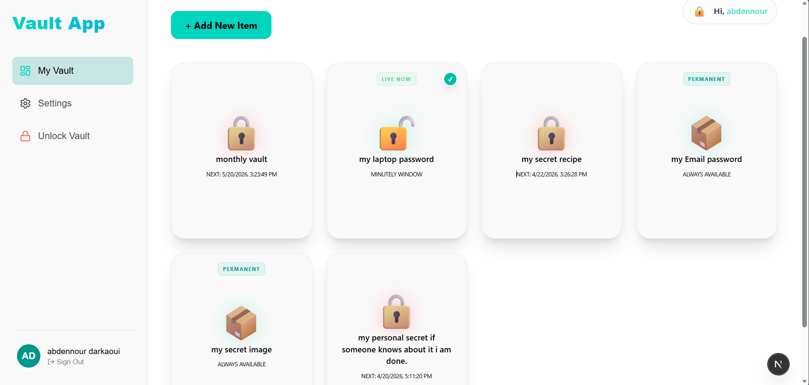

# 🛡️ VaultApp

VaultApp is a client-side encrypted vault where all sensitive data is encrypted **in the browser before being stored** in the database.

The goal of this project was to explore a **zero-knowledge architecture** using the Web Crypto API and understand the challenges around **key derivation, encryption flows, and data migration**.

---

##  Core Idea


Most apps store user data in a way that the server can read it.

VaultApp takes a different approach:

- Data is encrypted locally using **AES-GCM**
- The encryption key is derived from the user’s password using **PBKDF2 + salt**
- Only encrypted data is sent to Supabase
- The server never has access to the plaintext data or the master password

---

##  How It Works (Simplified Flow)

1. User enters their master password  
2. A cryptographic key is derived using PBKDF2 and a unique salt  
3. Data (notes, passwords, images) is encrypted using AES-GCM in the browser  
4. Encrypted data is stored in Supabase  
5. During a session, the key is kept in memory and used to decrypt data when needed  
6. When the app locks (inactivity or refresh), the key is discarded  

---

##  Key Features

- **Secure Unlock Flow**  
  Includes password validation and controlled unlock attempts  

- **Vault Migration (Password Change)**  
  Re-encrypts all stored data with a new key derived from the new password  

- **Auto-Lock System**  
  Locks the vault after inactivity to prevent unauthorized access  

- **Export Data**  
  Allows users to export decrypted data as JSON  

- **Hard Reset**  
  Clears all vault data and resets the vault state  

- **Theming**  
  Light/Dark mode using CSS variables  

---

## Challenges & Design Decisions

- **Key Management**  
  Since keys never leave the client, they must be carefully handled in memory and cleared on lock  

- **Re-encryption Flow**  
  Changing the master password requires decrypting and re-encrypting every item safely without data loss  

- **Async Operations**  
  Handling multiple encryption/decryption operations required careful control to avoid partial failures  

- **Security vs UX Tradeoffs**  
  Features like auto-lock improve security but must be balanced to avoid frustrating the user  

---

## Tech Stack

- **Framework:** Next.js 16 (App Router + Turbopack)  
- **Language:** TypeScript  
- **Styling:** Tailwind CSS 4  
- **Backend/Auth:** Supabase (`@supabase/ssr`)  
- **Crypto:** Web Crypto API (AES-GCM, PBKDF2)  
- **Icons:** Lucide React  

---

**Live Demo**: [vault-app-gray.vercel.app](https://vault-app-gray.vercel.app)
## Contact

Feel free to reach out if you have questions or want to connect:

- [LinkedIn](https://www.linkedin.com/in/abdennour-darkaoui-2b2873356/)
- [abd@darkaoui.org](mailto:abd@darkaoui.org)


- My Discord:abdel_07532

## Preview



##  Installation & Setup

```bash
# Clone this repo
git clone https://github.com/7abd/vault-app

# Go into the project___
cd vault-app

# Install dependencies
npm install

# Run the development server
npm run dev


##  Getting Started

### 1. Prerequisites
- Node.js 20+
- A Supabase project (Auth enabled + `vault_items` table created)

### 2. Environment Setup
Create a `.env.local` file:
```env
NEXT_PUBLIC_SUPABASE_URL=your_project_url
NEXT_PUBLIC_SUPABASE_ANON_KEY=your_anon_key